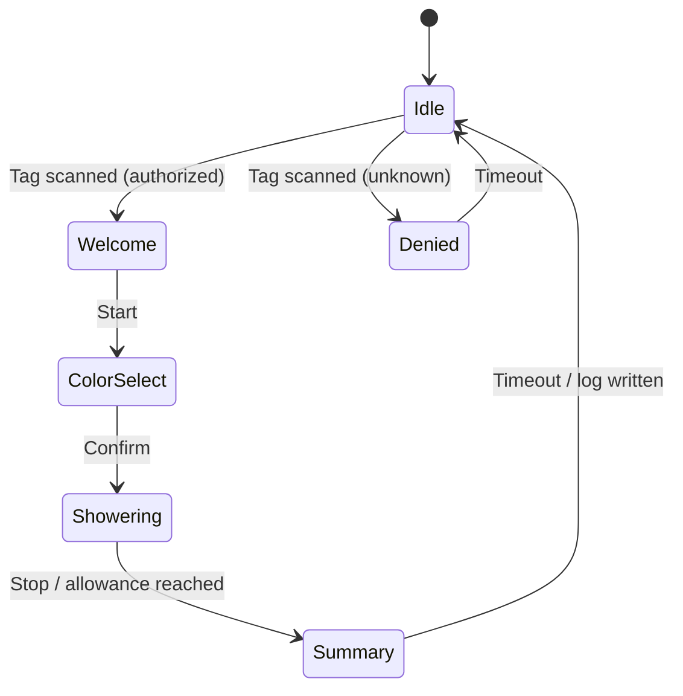

# UI — Screens & Workflow

Screen layouts and interaction flow for the M5Stack Tough display.

------------------------------------------------------------------------

## State Flow

------------------------------------------------------------------------

## Screens

### Idle
- Camp branding / status
- "Scan your tag to start"
- Battery / system status indicator

### Welcome
- Greeting with user name
- Remaining water allowance (if policy enabled)

### Denied
- "Tag not recognized"
- Return to idle after timeout

### Color / Effect Select
- LED color and effect chooser
- Confirm to enable pump

### Showering (active session)
- Live water used (gal / L)
- Elapsed time
- Stop button

### Summary
- Gallons used
- Elapsed / flow time
- Average flow
- "Logged — thank you"

------------------------------------------------------------------------

## Open UI Decisions

- Final layout and theme.
- Units display (gallons vs liters).
- Allowance warnings / cutoff behavior.

> _TODO: add wireframes / mockups to drawings/._
