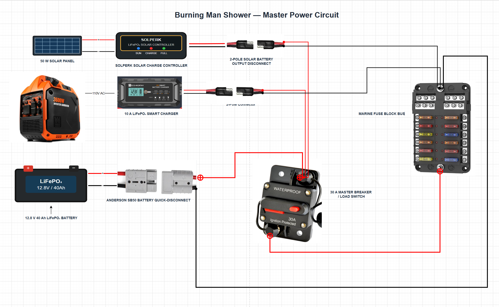

# Burning Man Shower Controller Project

Two independent, solar-powered shower stations for Burning Man with
RFID/NFC access control and per-person water logging.

## Project Goals

- Authenticate users via RFID/NFC tags.
- Measure and log water usage per person.
- Enable the pump only for authorized users.
- Store logs on an SD card.
- Control decorative and utility lighting.
- Provide USB-C charging only during an active shower session.
- Operate primarily from solar with generator-assisted charging.
- Support quick battery swaps using a single Anderson connector.
- Survive the harsh playa environment.

The two showers are completely independent. Their CSV logs can be merged
after the event.

------------------------------------------------------------------------

## System at a Glance

- **Water:** 500 gal tank → strainer → SEAFLO 12V pump → accumulator →
  propane heater/cold bypass → mixing valve → flow sensor → shower head.
- **Power:** 12.8V 30Ah LiFePO₄ per station, 50W solar +
  generator-assisted AC charging, 30A breaker + fused distribution.
- **Control:** M5Stack Tough + PaHub (I²C), RFID2 reader, 4Relay,
  flow-sensor pulse counting, SD-card CSV logging.

------------------------------------------------------------------------

## Documentation Index

| Document | Purpose |
|----------|---------|
| [BOM.md](BOM.md) | Bill of Materials |
| [Wiring.md](Wiring.md) | Electrical wiring & power |
| [Plumbing.md](Plumbing.md) | Plumbing layout |
| [SoftwareSpec.md](SoftwareSpec.md) | Firmware architecture |
| [UI.md](UI.md) | Screen layouts & workflow |
| [Calibration.md](Calibration.md) | Flow meter calibration |
| [Assembly.md](Assembly.md) | Step-by-step build guide |
| [TestProcedure.md](TestProcedure.md) | Bench testing checklist |
| [drawings/](drawings/) | Schematics & layout diagrams |

------------------------------------------------------------------------

## Remaining Decisions

### Hardware
- Select LED strip.
- Decide LED switching (relay vs MOSFET).
- Add battery monitor.

### Electrical
- Finalize fuse sizes.
- Measure flow sensor output voltage.
- Determine whether to inject separate 5V into the PaHub.

### Software
- Water allowance policy.
- Final UI.
- RFID enrollment workflow.

------------------------------------------------------------------------

## Main Circuit Wiring

> Editable source: [Camp_Shower_Master_Power.drawio](drawings/Camp_Shower_Master_Power.drawio)
> — open with [draw.io / diagrams.net](https://app.diagrams.net) or the
> VS Code Draw.io Integration extension.

The main power system is designed around a single removable 12V LiFePO₄ battery connected to the shower system through a 2-pole Anderson quick-disconnect connector.

### Battery Connection

The battery itself should have only two electrical connections:

- Battery positive → Anderson positive
- Battery negative → Anderson negative

No solar, charger, fuse-box, or accessory wiring should be attached directly to the battery terminals. This keeps battery replacement simple and allows the battery to be removed by disconnecting a single Anderson connector.

On the system side of the Anderson connector:

- Anderson negative connects directly to the fuse block's negative bus.
- Anderson positive connects to the **battery-side terminal** of the 30A manual-reset master circuit breaker.

The load-side terminal of the master breaker connects to the fuse block's main positive input.

This means the master breaker controls all downstream shower loads, while the battery remains available to the charging systems when the breaker is switched off.

### Charging Connections

Both charging systems connect on the **battery side of the master breaker**.

#### Solar Charging

The 50W solar panel connects to the SOLPERK LiFePO₄-compatible solar charge controller.

The controller's battery-output cable contains a 2-pole disconnect connector.

After that connector:

- Solar controller positive → battery-side terminal of the master breaker
- Solar controller negative → fuse block negative bus

The solar controller therefore remains electrically connected to the battery even when the master breaker is switched off.

#### 110V Generator Charger

The 10A LiFePO₄ smart charger is powered from the 110V generator/power strip.

Its DC output also contains a 2-pole disconnect connector.

After that connector:

- Charger positive → battery-side terminal of the master breaker
- Charger negative → fuse block negative bus

Like the solar controller, the AC charger remains connected to the battery when the master breaker is off.

### Why the Chargers Are Connected Before the Master Breaker

The master breaker is intended to function as a **load disconnect**, not as a charging disconnect.

With the breaker OFF:

- The pump and all downstream shower electronics are disabled.
- The fuse block positive bus is de-energized.
- The battery can still receive charge from the solar controller.
- The battery can still receive charge from the 110V charger.

This allows the shower system to be shut down while the battery continues charging.

Both the solar controller and the 110V charger may remain connected to the battery at the same time, provided both are configured for LiFePO₄ charging.

They regulate their own output based on battery voltage, so simultaneous connection is normal and does not require manually selecting one charger or the other.

### Battery Removal / Replacement Procedure

The charging sources should be disconnected before removing the battery.

Use the following sequence:

1. **Disconnect the solar panel**
   - Separate the 2-pole solar charging connector.
   - This removes solar input before the battery is disconnected from the solar controller.

2. **Disable the 110V charger**
   - Turn off the generator/power strip, unplug the charger, or separate the charger's 2-pole DC connector.

3. **Turn OFF the 30A master breaker**
   - This disconnects all downstream shower loads.

4. **Disconnect the Anderson battery connector**
   - The battery can now be removed or replaced.

To reconnect the system, use the reverse order:

1. Connect the battery Anderson connector.
2. Turn on the master breaker if the shower system should be active.
3. Reconnect the 110V charger as needed.
4. Reconnect the solar panel.

### Important Solar Controller Note

The solar controller should not normally be left connected to an active solar panel with no battery connected.

For that reason, the solar-panel disconnect should always be opened before disconnecting the Anderson battery connector.

The battery should be connected before reconnecting the solar panel.

### Fuse Block Logic

The marine fuse block contains:

- A common positive input feeding the individual branch fuses.
- A separate integrated negative bus.

The master breaker's load-side terminal feeds the fuse block's positive input.

Each downstream load receives positive power through its own branch fuse.

All downstream negative returns connect directly to the fuse block's negative bus.

Do not fuse or switch the common negative return.

### Summary

The power topology is:

Battery  
→ Anderson quick disconnect  
→ battery-side charging node  
→ 30A master breaker  
→ fuse block positive bus  
→ individually fused shower loads

Solar controller and 110V charger both connect to the battery-side charging node and the common negative bus.

This allows charging to continue with the master breaker OFF while still allowing the entire battery to be removed with one Anderson connector.

------------------------------------------------------------------------

## Next Phase

Produce a complete engineering package:

1. Electrical schematic.
2. Mechanical layout.
3. Pin assignment document.
4. Software specification.
5. Bill of Materials (BOM).

This README is the project index; detailed content lives in the linked
documents above.
