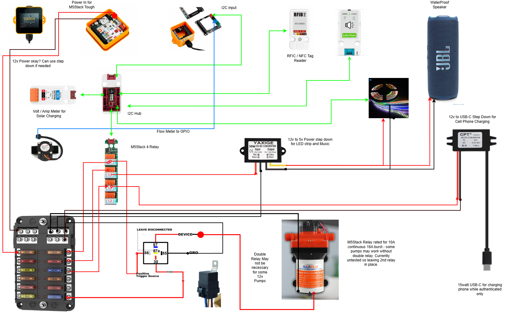
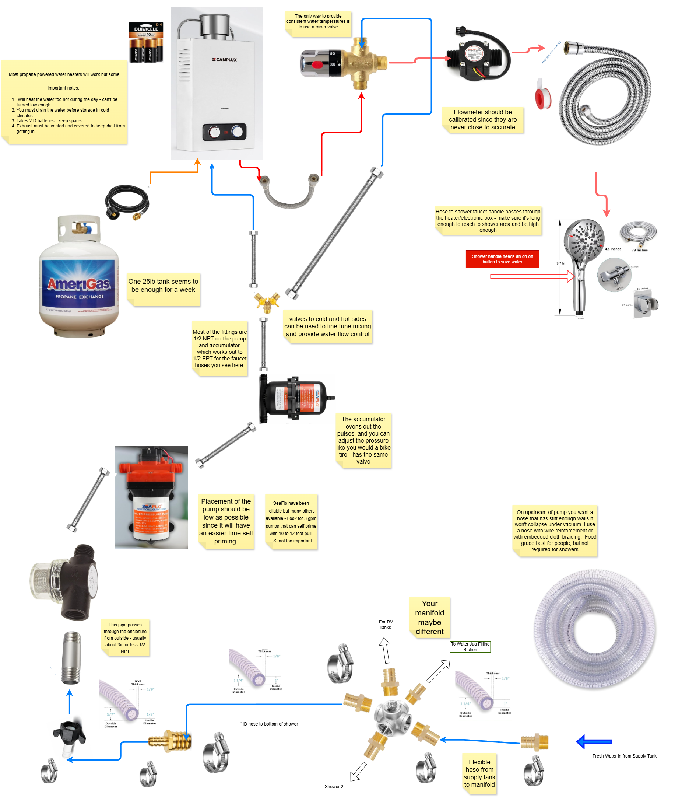

# Burning Man Shower Controller Project

Two independent, solar-powered shower stations for Burning Man with
RFID/NFC access control and per-person water logging.

## Project Goals

- Authenticate users via RFID/NFC tags.
- Measure and log water usage per person.
- Enable the pump only for authorized users.
- Store logs on an SD card.
- Control decorative and utility lighting.
- Provide USB-C charging only during an active shower session.
- Operate primarily from solar with generator-assisted charging.
- Support quick battery swaps using a single Anderson connector.
- Survive the harsh playa environment.

The two showers, the water-jug fill station and the RV fill station each run
their own controller and SD card, but share one router-free ESP-NOW network
("CampNet"). Wristband enrollment and station limits sync between them, and
each station shows a person's camp-wide water total when their shower or fill
ends. See [firmware/shower-controller/README.md](firmware/shower-controller/README.md).

------------------------------------------------------------------------

## System at a Glance

- **Water:** 500 gal tank → strainer → SEAFLO 12V pump → accumulator →
  propane heater/cold bypass → mixing valve → flow sensor → shower head.
- **Power:** 12.8V 30Ah LiFePO₄ per station, 50W solar +
  generator-assisted AC charging, 30A breaker + fused distribution.
- **Control:** M5Stack Tough + PaHub (I²C), RFID2 reader, 4Relay,
  flow-sensor pulse counting, SD-card CSV logging.

------------------------------------------------------------------------

## Documentation Index

| Document | Purpose |
|----------|---------|
| [BOM.md](BOM.md) | Bill of Materials |
| [Wiring.md](Wiring.md) | Electrical wiring & power |
| [Plumbing.md](Plumbing.md) | Plumbing layout |
| [SoftwareSpec.md](SoftwareSpec.md) | Firmware architecture |
| [UI.md](UI.md) | Screen layouts & workflow |
| [Calibration.md](Calibration.md) | Flow meter calibration |
| [Assembly.md](Assembly.md) | Step-by-step build guide |
| [TestProcedure.md](TestProcedure.md) | Bench testing checklist |
| [drawings/](drawings/) | Schematics & layout diagrams |

------------------------------------------------------------------------

## Remaining Decisions

### Hardware
- Select LED strip.
- Decide LED switching (relay vs MOSFET).
- Add battery monitor.

### Electrical
- Finalize fuse sizes.
- Measure flow sensor output voltage.
- Determine whether to inject separate 5V into the PaHub.

### Software
- Water allowance policy.
- Final UI.
- RFID enrollment workflow.

------------------------------------------------------------------------

## Main Circuit Wiring

> Editable source: [Camp_Shower_Master_Power.drawio](drawings/Camp_Shower_Master_Power.drawio)
> — open with [draw.io / diagrams.net](https://app.diagrams.net) or the
> VS Code Draw.io Integration extension.

The main power system is designed around a single removable 12V LiFePO₄ battery connected to the shower system through a 2-pole Anderson quick-disconnect connector.

### Battery Connection

The battery itself should have only two electrical connections:

- Battery positive → Anderson positive
- Battery negative → Anderson negative

No solar, charger, fuse-box, or accessory wiring should be attached directly to the battery terminals. This keeps battery replacement simple and allows the battery to be removed by disconnecting a single Anderson connector.

On the system side of the Anderson connector:

- Anderson negative connects directly to the fuse block's negative bus.
- Anderson positive connects to the **battery-side terminal** of the 30A manual-reset master circuit breaker.

The load-side terminal of the master breaker connects to the fuse block's main positive input.

This means the master breaker controls all downstream shower loads, while the battery remains available to the charging systems when the breaker is switched off.

### Charging Connections

Both charging systems connect on the **battery side of the master breaker**.

#### Solar Charging

The 50W solar panel connects to the SOLPERK LiFePO₄-compatible solar charge controller.

The controller's battery-output cable contains a 2-pole disconnect connector.

After that connector:

- Solar controller positive → battery-side terminal of the master breaker
- Solar controller negative → fuse block negative bus

The solar controller therefore remains electrically connected to the battery even when the master breaker is switched off.

#### 110V Generator Charger

The 10A LiFePO₄ smart charger is powered from the 110V generator/power strip.

Its DC output also contains a 2-pole disconnect connector.

After that connector:

- Charger positive → battery-side terminal of the master breaker
- Charger negative → fuse block negative bus

Like the solar controller, the AC charger remains connected to the battery when the master breaker is off.

### Why the Chargers Are Connected Before the Master Breaker

The master breaker is intended to function as a **load disconnect**, not as a charging disconnect.

With the breaker OFF:

- The pump and all downstream shower electronics are disabled.
- The fuse block positive bus is de-energized.
- The battery can still receive charge from the solar controller.
- The battery can still receive charge from the 110V charger.

This allows the shower system to be shut down while the battery continues charging.

Both the solar controller and the 110V charger may remain connected to the battery at the same time, provided both are configured for LiFePO₄ charging.

They regulate their own output based on battery voltage, so simultaneous connection is normal and does not require manually selecting one charger or the other.

### Battery Removal / Replacement Procedure

The charging sources should be disconnected before removing the battery.

Use the following sequence:

1. **Disconnect the solar panel**
   - Separate the 2-pole solar charging connector.
   - This removes solar input before the battery is disconnected from the solar controller.

2. **Disable the 110V charger**
   - Turn off the generator/power strip, unplug the charger, or separate the charger's 2-pole DC connector.

3. **Turn OFF the 30A master breaker**
   - This disconnects all downstream shower loads.

4. **Disconnect the Anderson battery connector**
   - The battery can now be removed or replaced.

To reconnect the system, use the reverse order:

1. Connect the battery Anderson connector.
2. Turn on the master breaker if the shower system should be active.
3. Reconnect the 110V charger as needed.
4. Reconnect the solar panel.

### Important Solar Controller Note

The solar controller should not normally be left connected to an active solar panel with no battery connected.

For that reason, the solar-panel disconnect should always be opened before disconnecting the Anderson battery connector.

The battery should be connected before reconnecting the solar panel.

### Fuse Block Logic

The marine fuse block contains:

- A common positive input feeding the individual branch fuses.
- A separate integrated negative bus.

The master breaker's load-side terminal feeds the fuse block's positive input.

Each downstream load receives positive power through its own branch fuse.

All downstream negative returns connect directly to the fuse block's negative bus.

Do not fuse or switch the common negative return.

### Summary

The power topology is:

Battery  
→ Anderson quick disconnect  
→ battery-side charging node  
→ 30A master breaker  
→ fuse block positive bus  
→ individually fused shower loads

Solar controller and 110V charger both connect to the battery-side charging node and the common negative bus.

This allows charging to continue with the master breaker OFF while still allowing the entire battery to be removed with one Anderson connector.

------------------------------------------------------------------------

## Control Circuits

> Editable source: [Control.drawio](drawings/Control.drawio)
> — open with [draw.io / diagrams.net](https://app.diagrams.net) or the
> VS Code Draw.io Integration extension.

The control system is built around an **M5Stack Tough** controller. The Tough handles RFID/NFC authentication, shower timing, water-flow measurement, relay control, lighting control, data logging, and future status/alert functions.

The control electronics are electrically separate from the high-current load distribution, except where the M5Stack relay contacts switch the 12V loads.

### M5Stack Tough Power

The M5Stack Tough may be powered directly from the 12V LiFePO₄ system through its 6–24V DC power input.

The Tough therefore does not require a separate 12V-to-5V converter for its own power.

The Tough remains powered whenever the master power circuit is enabled so it can:

- Monitor RFID/NFC tags.
- Control the shower session.
- Count flow-meter pulses.
- Operate the relay module.
- Control lighting.
- Log water usage.
- Monitor charging/battery status.
- Provide future Wi-Fi or Bluetooth status/alert functions.

USB-C on the Tough should normally be reserved for programming/service rather than permanent power.

---

## I²C Control Bus

The M5Stack Tough communicates with most control peripherals through its I²C connection.

An **I²C hub / multiplexer** provides multiple physical connections from the Tough to the individual control devices.

Planned I²C devices include:

- M5Stack RFID2 RFID/NFC reader.
- M5Stack Unit 4Relay.
- Solar charging voltage/current monitor.
- Future keypad or button interface.
- Future battery-monitoring hardware.
- Additional sensors or control modules as required.

The I²C cable carries:

- 5V
- Ground
- SDA
- SCL

The M5Stack Unit 4Relay receives the power required to operate its internal electronics and relay coils from this 5V I²C/Grove connection.

The relay load terminals do **not** provide power to the relay electronics and do not require a ground connection in order for a relay to operate.

---

## RFID / NFC Reader

The RFID2 reader is connected to the I²C hub.

When a user presents an authorized RFID/NFC tag:

1. The Tough reads the tag UID.
2. The UID is matched against the camp user database.
3. The shower session is authorized.
4. The appropriate relay-controlled accessories become available.
5. Water usage is recorded against that user's UID.

NTAG-series NFC tags will be tested with the RFID2 reader before final tag selection.

---

## M5Stack Unit 4Relay

The M5Stack Unit 4Relay is controlled over I²C.

The unit contains four independent normally-open relay channels.

Each relay is rated by M5Stack for:

- 10A continuous
- 16A instantaneous
- Up to 28V DC

The relay contacts are electrically independent of the 5V control circuitry.

One planned physical wiring arrangement is:

| Relay | Function |
|------|----------|
| CH1 | Shower pump |
| CH2 | USB-C charging power |
| CH3 | LED / entertainment power |
| CH4 | Utility lighting or future use |

Pump defaults to CH1. The phone-charger and accessory roles intentionally start
unassigned after a firmware upgrade, and an admin selects three unique physical
channels from the station's **Relay & power** card after verifying the wiring.
Assignments are stored per controller because stations may be wired
differently. The same card can persistently enable/disable accessory power and
run a bounded five-second test of any physical channel while the station is
idle.

---

## Pump Control

The SEAFLO 42-series 12V pump is controlled by one channel of the M5Stack 4Relay module.

The basic circuit is:

Fused +12V  
→ M5Stack relay contact  
→ Pump positive

Pump negative  
→ Fuse-block negative bus

The relay coil itself is powered from the M5Stack 5V/I²C supply.

### External Automotive Relay

An automotive relay is currently shown in the drawing as an optional second relay between the M5Stack relay and the pump.

The SEAFLO pump draws approximately 7–8A maximum, while the M5Stack relay is rated for 10A continuous and 16A instantaneous.

Because the pump is within the M5Stack relay rating, the current plan is to bench-test the pump directly through the M5Stack relay.

If the M5Stack relay operates reliably without excessive heating, contact arcing, or other problems, the automotive relay can be eliminated.

If additional isolation or contact-life margin is desired, the M5Stack relay can instead energize the automotive relay coil and the automotive relay can carry the pump current.

The wiring should therefore allow either arrangement during testing.

---

## USB-C Charging Outlet

A separate 12V-to-USB-C converter provides approximately 15W of USB-C power for users to charge a phone during their shower.

This outlet is **not available continuously**.

Its 12V input is switched by one channel of the M5Stack relay module.

The software enables USB-C power only after:

1. A valid RFID/NFC tag has been authenticated.
2. A shower session has started.

When the shower session ends or times out, the Tough turns the USB-C relay off.

This prevents the shower charging outlet from becoming a general-purpose camp phone charger.

The USB converter negative remains connected to the common negative bus; the positive supply is switched by the relay.

---

## LED Lighting and Entertainment Power

The shower will have addressable LED lighting around its perimeter.

The LED system uses a dedicated high-current 12V-to-5V converter rather than drawing LED power from the M5Stack Tough.

The planned arrangement is:

12V fused supply  
→ 12V-to-5V high-current converter  
→ LED strip power

The LED controller/data signal is provided by the M5Stack control system.

The LED strip ground and controller ground must share the common system ground so the data signal has the correct electrical reference.

The LED power supply may also provide 5V power for entertainment accessories where appropriate.

The intended accessory relay powers this converter, the outer display, and the
speaker supply whenever the controller can communicate with the relay module.
It may briefly turn off during boot, reboot, relay recovery, remapping, or a
bounded raw-channel test because those operations begin from an all-off state.

Decorative LEDs should normally operate at reduced brightness to limit power consumption.

Software may provide:

- User-selected colors.
- Animated patterns.
- RFID-specific effects.
- Session-start effects.
- Session-ending effects.
- Water-use warnings.
- Automatic shutdown when the shower is idle.

---

## Waterproof Bluetooth Speaker

A waterproof Bluetooth speaker may be installed in the shower area.

The speaker itself communicates wirelessly with the user's phone.

Where external charging power is provided to the speaker, it should come from the separately regulated accessory/5V supply rather than from the M5Stack Tough.

The entertainment power circuit may be switched along with the active shower session so accessories are not powered continuously.

---

## Solar Charging Monitor

A voltage/current monitor may be installed in the solar-controller charging circuit.

The purpose of this monitor is primarily diagnostic rather than load control.

The M5Stack should be able to determine:

- Battery voltage.
- Whether the solar controller is producing charging current.
- Approximate solar charging current.
- Whether charging appears abnormal.

Monitoring the solar charging branch rather than inserting a current-monitoring device into the entire shower power path avoids placing an additional component in series with the pump and other critical loads.

Possible hardware includes an INA226-based I²C monitor or another suitable current/voltage sensor.

The final monitoring hardware is still TBD.

---

## Battery and Charging Status

Battery voltage may be used for basic status warnings.

For example, software can distinguish approximately between:

- Charging voltage.
- Normal resting voltage.
- Low battery voltage.
- Critical battery voltage.

Because LiFePO₄ batteries have a relatively flat discharge-voltage curve, voltage alone should not be treated as a precise state-of-charge measurement.

Solar charging current provides an additional useful diagnostic.

Example status:

Battery: 13.4V  
Solar: +2.7A  
Status: CHARGING

or:

Battery: 12.8V  
Solar: 0.0A  
Status: LOW / NOT CHARGING

Future software may send alerts over Wi-Fi or Bluetooth if:

- Battery voltage becomes low.
- Solar charging unexpectedly stops.
- The controller detects a fault.
- Water flow occurs when no session is authorized.
- Other abnormal conditions are detected.

---

## Flow Sensor

The water-flow sensor connects directly to an M5Stack GPIO input rather than through the I²C bus.

The sensor produces pulses proportional to water flow.

The Tough counts these pulses using an interrupt and converts the pulse count into gallons or liters using a calibration constant.

Each shower's flow sensor will be calibrated individually.

Water volume is calculated from the pulse count, not from pump run time.

---

## Grounds

All DC systems share the same common negative reference at the fuse-block negative bus.

This includes:

- M5Stack Tough.
- I²C peripherals.
- Pump.
- USB converter.
- LED converter.
- LED strip.
- Charging monitors.
- Sensors.
- Accessory electronics.

High-current negative returns should run directly to the negative bus rather than through M5Stack modules or small control wiring.

---

## Control-System Design Principle

The M5Stack system controls loads but should carry as little high-current power as practical.

The basic separation is:

**Control power and signals**
- Tough
- I²C hub
- RFID reader
- Sensors
- Relay coils
- GPIO

**Load power**
- Pump
- LED strip
- USB charging
- Utility lighting
- Entertainment accessories

The relay contacts form the interface between these two parts of the system.

This arrangement minimizes the amount of high-current wiring passing through the controller electronics and makes individual loads easier to troubleshoot or replace.

------------------------------------------------------------------------

## Plumbing System

> Editable source: [Plumbing.drawio](drawings/Plumbing.drawio)
> — open with [draw.io / diagrams.net](https://app.diagrams.net) or the
> VS Code Draw.io Integration extension.

Each shower is supplied from the camp's fresh-water tank through a common distribution manifold.

The plumbing system is designed to provide pressurized water, propane-heated hot water, automatic temperature mixing, and accurate measurement of the actual water delivered to each shower.

### Water Supply and Manifold

Fresh water from the main supply tank enters the shower system through flexible reinforced hose and connects to a distribution manifold.

The manifold provides branches for:

- Shower 1
- Shower 2
- Water-jug filling station
- Additional future water connections if required

Flexible reinforced 1/2-inch ID hose is used between the tank and manifold and for the primary shower supply plumbing.

The suction-side hose should be reinforced so it cannot collapse under pump vacuum.

---

## Pump

Each shower uses a 12V SEAFLO pressure pump rated at approximately:

- 3.0 GPM
- 55 PSI
- Automatic pressure-switch operation

The pump should be mounted as low as practical relative to the water tank.

A low mounting position improves gravity feed to the pump inlet and makes the pump easier to prime.

The pump draws water from the supply manifold and pressurizes the remainder of the shower plumbing.

---

## Accumulator

An accumulator is installed immediately downstream of the pump.

The accumulator:

- Smooths pressure fluctuations from the diaphragm pump.
- Reduces rapid pump cycling.
- Provides a small pressurized reserve of water.
- Produces steadier flow at the shower head.

The accumulator air pressure can be adjusted through its Schrader-style valve.

Initial pressure should be set according to the pump/accumulator manufacturer's recommendations and may be fine-tuned during system testing.

---

## Hot and Cold Water Split

After the accumulator, the pressurized water supply splits into two branches.

### Cold Branch

One branch bypasses the water heater and supplies cold water directly to the thermostatic mixing valve.

### Hot Branch

The second branch passes through the propane water heater and then feeds the hot-water input of the thermostatic mixing valve.

This arrangement is intentional.

The propane heater can produce water that is considerably hotter than desired, especially during hot daytime conditions. Rather than attempting to regulate shower temperature using the heater alone, the system mixes heated water with unheated tank water.

Manual valves on the hot and cold branches may be used for coarse balancing and service isolation.

---

## Propane Water Heater

The shower uses a portable propane-powered water heater.

The heater receives pressurized cold water from the pump and sends heated water to the thermostatic mixing valve.

Important operating considerations:

- The heater may produce excessively hot water during hot daytime conditions even at its minimum setting.
- The heater must be installed with adequate ventilation.
- Exhaust must not be obstructed.
- When stored in freezing climates, water should be drained from the heater to prevent freeze damage.
- Spare heater batteries should be kept available if the heater uses battery-powered ignition.

The propane supply is provided by an external propane cylinder connected with the appropriate regulator/hose assembly.

---

## Thermostatic Mixing Valve

The hot-water output from the heater and the cold-water bypass are connected to a thermostatic mixing valve.

The valve has three connections:

- HOT input
- COLD input
- MIXED output

The thermostatic valve automatically adjusts the hot/cold ratio to maintain the selected output temperature.

This provides more consistent shower temperature as:

- Tank-water temperature changes.
- Heater output changes.
- Ambient temperature changes.
- Water flow varies.

The mixing valve should be installed according to the manufacturer's marked HOT, COLD, and MIXED ports.

Manual valves on the hot and cold lines can be used for initial system balancing, but normal shower-temperature regulation should be performed by the thermostatic valve.

---

## Flow Meter

The electronic flow meter is installed **after the thermostatic mixing valve**.

This location is important because it allows the meter to measure the total volume of mixed water actually delivered to the user.

The flow sequence is:

Tank  
→ Pump  
→ Accumulator  
→ Hot/Cold Split  
→ Heater + Cold Bypass  
→ Thermostatic Mixing Valve  
→ Flow Meter  
→ Shower Hose  
→ Shower Head

The flow meter sends pulses to the M5Stack control system.

The controller counts those pulses and converts them into gallons or liters.

Each flow meter should be calibrated individually after the complete plumbing system is assembled.

Calibration should be performed by passing a known quantity of water through the shower and comparing that quantity with the pulse count reported by the controller.

The calibrated pulses-per-liter or pulses-per-gallon value should then be stored in the shower controller configuration.

---

## Shower Hose and Handset

The mixed and metered water feeds the flexible shower hose and handheld shower head.

The selected shower head includes an on/off control so the user can temporarily stop water flow while washing.

The pump's internal pressure switch and accumulator allow the plumbing system to remain pressurized while the shower-head valve is closed.

When the shower head is reopened, pressure falls and the pump automatically resumes operation, provided the M5Stack controller has authorized the current shower session.

---

## Hose and Fitting Sizes

Most of the shower plumbing uses:

- 1/2-inch NPT fittings
- 1/2-inch ID reinforced flexible hose
- Hose-barb adapters
- Stainless hose clamps
- Flexible braided connector hoses where useful for assembly and vibration isolation

Thread sealant appropriate for potable-water plumbing should be used on NPT threaded connections.

Hose-barb connections should be secured with properly sized clamps.

---

## Plumbing Design Principles

The plumbing system is designed around several priorities:

1. **Reliable pump priming**
   - Keep the pump low and minimize suction-side restriction.

2. **Stable pressure**
   - Use the accumulator to reduce diaphragm-pump pulsation and cycling.

3. **Safe and consistent temperature**
   - Do not depend on the propane heater alone for temperature control.
   - Mix hot and cold water using the thermostatic valve.

4. **Accurate water accounting**
   - Measure flow after hot and cold water have been recombined.

5. **Serviceability**
   - Use flexible hoses and removable fittings where practical.
   - Keep the pump, accumulator, heater, mixing valve, and flow meter accessible.

6. **Water conservation**
   - Use a shower head with an on/off control.
   - Measure actual delivered water for each authenticated shower session.

---

## Plumbing Test Procedure

Before normal use:

1. Fill the supply tank.
2. Open the appropriate manifold valve.
3. Verify the pump primes correctly.
4. Check all hose and threaded connections for leaks.
5. Pressurize the system and verify the pump shuts off normally.
6. Check accumulator operation.
7. Run cold water through the shower.
8. Start the propane heater and verify hot-water operation.
9. Adjust the thermostatic mixing valve to the desired maximum shower temperature.
10. Confirm that closing the shower-head valve stops flow and causes the pump to stop after pressure builds.
11. Verify that reopening the shower head restarts water flow.
12. Calibrate the flow meter using a known measured volume.
13. Recheck all fittings for leaks after the system has reached operating temperature and pressure.

------------------------------------------------------------------------

## Next Phase

Produce a complete engineering package:

1. Electrical schematic.
2. Mechanical layout.
3. Pin assignment document.
4. Software specification.
5. Bill of Materials (BOM).

This README is the project index; detailed content lives in the linked
documents above.
