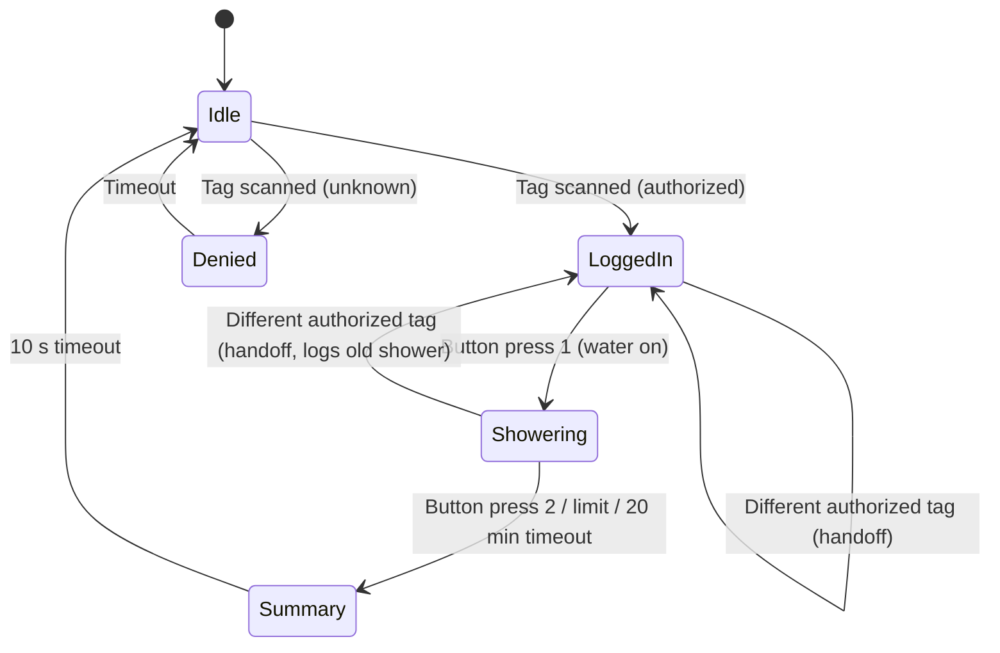

# UI — Screens & Workflow

Screen layouts and interaction flow for the M5Stack Tough display.

------------------------------------------------------------------------

## State Flow

------------------------------------------------------------------------

## Screens

### Idle
- Camp branding / status
- "Scan your tag to start"
- Battery / system status indicator

### Logged in
- Greeting with user name
- Water allowance
- "PRESS BUTTON TO START" (no touch; one physical button)

### Denied
- "Tag not recognized"
- Return to idle after timeout

### Showering (active session)
- Live water used (gal / L)
- Elapsed time
- "PRESS BUTTON TO FINISH"

### Summary (10 seconds, then Idle)
- Gallons used
- Elapsed time
- "Logged — thank you"

------------------------------------------------------------------------

## Open UI Decisions

- Final layout and theme.
- Units display (gallons vs liters).
- Allowance warnings / cutoff behavior.

Theme mockups (circus, neon, desert motel, blackout): open
`drawings/ui-mockups.html` in a browser. Touch is not used; all input is the
wristband and the single button.
