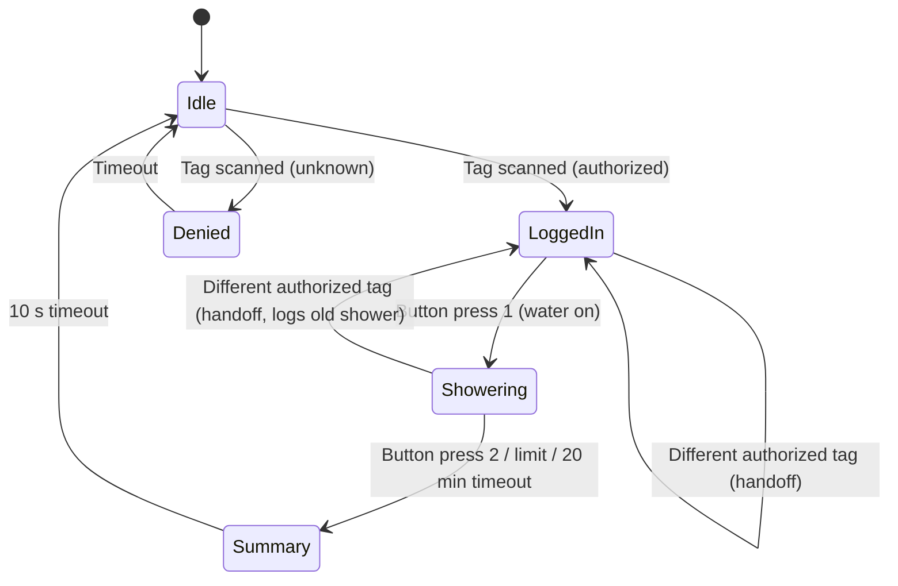

# UI — Screens & Workflow

Screen layouts and interaction flow for the M5Stack Tough display.

------------------------------------------------------------------------

## State Flow

------------------------------------------------------------------------

## Screens

### Idle
- Big Top red-and-cream sunburst, gold frame, and static marquee bulbs
- Role name plus `READY/SERVICE - n NET`
- "TAP YOUR WRISTBAND" with role-specific open wording

### Logged in
- "HOWDY" with a size-to-fit member name
- Camp-wide gallons used this burn
- "PRESS BUTTON TO START WATER" (no touch; one physical button)

### Denied
- "NOT AUTHORIZED" and the denial reason
- Return to idle after timeout

### Dispensing (active session)
- Member name and elapsed `MM:SS`
- Live water used in gallons to two decimal places
- Role-specific "used this shower/fill" wording
- "PRESS BUTTON WHEN DONE"

### Summary (10 seconds, then Idle)
- Ticket with gallons used, elapsed time, and camp-wide burn total
- Role-specific thanks message
- Logging failures retain the usage summary and direct the member to an admin

------------------------------------------------------------------------

## Display behavior

The implemented theme is Option A, **Big Top**, from
`drawings/ui-mockups.html`. All screens use gallons only. Allowance and limit
indicators are intentionally omitted from the display, but firmware enforcement
is unchanged. The frame is redrawn only on state transitions; active gallons
refresh at most four times per second and elapsed time once per second. Touch
is not used; all member input is the wristband and the single physical button.
